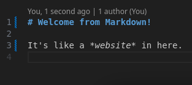
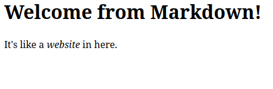

# Eleventy for Neocities Users




Do you like writing HTML for your website on [Neocities](https://neocities.org/) or [Nekoweb](https://nekoweb.org/), but get tired of manually writing lots of little tags like `<p>` and `<em>` and `<a href>` everywhere? Do you wish you could use Markdown on your site, just like we used to do on [Cohost](https://en.wikipedia.org/wiki/Cohost)? 

Good news! There's a tool called [**Eleventy**](https://www.11ty.dev/) that does exactly that. Eleventy is a **Static Site Generator**, which means that you write non-HTML code like `**this**`, and then compile, or "bake" it, into HTML code like `<strong>this</strong>` that you can copy to your website. I looked at several site generators on [Jamstack](https://jamstack.org/generators/), and I selected Eleventy for this tutorial because it gives you the most power for the least effort. It also runs the same everywhere, including Linux, Windows, and Mac, so I only have to write one tutorial.

By the end of this tutorial, you will have two copies of your site: the "source" version with a mix of HTML and Markdown files, and the "release" version with just regular HTML. You will also be able to re-build the release files whenever you want by typing **just one command**: `npm run build`.

## Installing Stuff

To get started, you will need:
- A text terminal, like Powershell.
- A text editor, like Notepad.
- NodeJS, a program used to run JavaScript apps like Eleventy.
- Any HTML files you want, from a Neocities page for example.

Your text terminal will depend on your operating system, but there is always one built in. On Windows, you can open the Start menu and type "Powershell". Don't worry, I'll explain exactly what you need to type, and why, when we get there.

You can use any text editor, but I recommend [VS Code](https://code.visualstudio.com/). It runs on Linux, Windows, and Mac, and it has some useful built-in tools that you might want later. It even has a built in text terminal, so if you use this, you don't need to open Powershell. If that sounds like too much right now, just use Notepad, you can always come back to this later.

NodeJS is required to run Eleventy. You can install it from [nodejs.org](https://nodejs.org/en). If you're familiar with a package manager like *winget* or *apt-get*, you can install NodeJS that way instead.

If you have some HTML files from a previous website, keep them handy, we'll use them shortly.

## Creating a new Eleventy project

Eleventy is a NodeJS app, so it needs to be placed in a folder containing a special file called *package.json*. Create a folder somewhere on your system. I typically create a folder with a name like *C:/Users/nycki/Code/example.com/*, replacing *example.com* with the name of your website. I'll refer to the *example.com* folder as your **project folder.**

Open your text terminal and change directories into the project folder. In Powershell, type this command and press Enter:

```ps
cd C:/Users/nycki/Code/example.com
```

NodeJS comes with a program called *npm*, which stands for NodeJS Package Manager [^1]. We'll use npm to *initialize* a new project, using *-y* to use all default project settings, and then *install* the latest version of Eleventy into that project. Type Enter after each command:

```ps
npm init -y
npm install @11ty/eleventy
```

This will create the file *package.json*, the file *package-lock.json*, and the folder *node_modules*.

- *package.json* is the "main file" for any NodeJS project. It contains the names and version numbers of modules like Eleventy.
- *package-lock.json* is used by npm to keep track of any "extra stuff" it decided while installing Eleventy. You can read it if you want, but you don't need to do anything with it.
- *node_modules* is where NodeJS stores modules like Eleventy. If *node_modules* is missing (or you deleted it), you can re-download it by typing just `npm install`, with nothing after the word "install".

Open up *package.json* in your text editor. You should see that it contains some code like this:

```json
{
  "name": "eleventy-for-neocities-users",
  "version": "1.0.0",
  "description": "",
  "main": "index.js",
  "scripts": {
    "test": "echo \"Error: no test specified\" && exit 1"
  },
  "keywords": [],
  "author": "",
  "license": "ISC",
  "dependencies": {
    "@11ty/eleventy": "^3.1.2"
  }
}
```

This is a **json** file, which is a type of config file used by most JavaScript programs. It has one *script* defined already, a "test" script that does nothing. Let's add two new scripts: one to build the website, and one to preview it.

```json
"scripts": {
  "test": "echo \"Error: no test specified\" && exit 1",
  "build": "eleventy",
  "serve": "eleventy --serve"
},
```

Make sure to add a comma between the test script and the build script. The file should now look like this:

```json
{
  "name": "eleventy-for-neocities-users",
  "version": "1.0.0",
  "description": "",
  "main": "index.js",
  "scripts": {
    "test": "echo \"Error: no test specified\" && exit 1",
    "build": "eleventy",
    "serve": "eleventy --serve"
  },
  "keywords": [],
  "author": "",
  "license": "ISC",
  "dependencies": {
    "@11ty/eleventy": "^3.1.2"
  }
}
```

If you want, you can type `npm run build` in your text terminal to run that script, and build the site now. It should generate a folder called *_site*, but it won't have anything inside it yet! Let's fix that.

[^1]: officially npm doesn't stand for anything. But like. Come on. It's pretty obvious.

## Adding files to your site

Create two empty folders inside the project called *src* and *static*, and create a file inside *static* named *index.html*. So if your project folder is *example.com*, this will be *example.com/static/index.html*. Type whatever you want inside this file. For example:

```html
<h1>Hello from HTML!</h1>
```

We'll tell Eleventy to copy this file into your website.

Create a new file in the project called *eleventy.config.js*. So, if your project folder is *example.com*, this is *example.com/eleventy.config.js*. Copy this code into that file. You don't need to understand all these settings right now, but if you're curious, there is a [full list of options](https://www.11ty.dev/docs/config/) on Eleventy's website.

```js
module.exports = function(eleventyConfig) {
    eleventyConfig.setInputDirectory('src');
    eleventyConfig.addPassthroughCopy({ 'static': '/' });
};

module.exports.config = {
    markdownTemplateEngine: 'njk',
};
```

Now, if you run the command `npm run build` in your text terminal, you'll see that all the files from *static* get copied into *_site*. Congratulations! You have a working Eleventy project! If you want to skip all this setup next time, you can just copy the files out of this very repo, by clicking Code -> Download Zip in the top right.

If you want to import an existing website, now is the time to **copy all your HTML files into the *static* folder**.

## Using Markdown

Earlier we created the *src* folder but we haven't used it at all. The *src* folder is where we put "source files", which are anything that needs to be baked (or "compiled") into HTML before we can copy it to our website. Let's write a Markdown source file now. Create the file *src/my-page.md* with the following code:

```md
# Welcome from Markdown!

It's like a *website* in here.
```

Since we set up the build script earlier, you can run that right now! Type `npm run build` in your text terminal, and check the output in *_site*. You should see a file called *_site/my-page/index.html* that looks like this:

```html
<h1>Welcome from Markdown!</h1>
<p>It's like a <em>website</em> in here.</p>
```

And bam, we have Markdown to HTML conversion working! You could upload the *_site* folder to Neocities right now if you want! 

## Previewing your changes

Before we do anything else, you might want to preview your site. You can do that with the other script we set up: `npm run serve`. Type that command in your text terminal, and you should see some output like this:

```txt
> eleventy-for-neocities-users@1.0.0 serve
> eleventy --serve

[11ty] Writing ./_site/my-page/index.html from ./src/my-page.md (njk)
[11ty] Copied 1 Wrote 1 file in 0.13 seconds (v3.1.2)
[11ty] Watching…
[11ty] Server at http://localhost:8080/
```

Go ahead and open a web browser like Chrome or Firefox, and type in that address, <http://localhost:8080/>, and you should see a preview of your website! You can even go to <http://localhost:8080/my-page/> to see the new page we just created.

While the preview server is running, you can keep working on your website. It will **automatically re-build whenever you save a file.**

When you want to stop the preview server, hold Ctrl and press C. In this case, Ctrl-C stands for "cancel" instead of "copy".

## Mixing Markdown with HTML

That markdown page is convenient but it's pretty bland. How do we get our cool style sheet into it? The first and simplest way is to *mix Markdown with HTML.* If you don't have a stylesheet yet, here's a simple one I like to use. Copy this text into *static/style.css*.

```css
body {
    max-width: 100rem;
    padding: 0 1rem;
    margin: 0 auto 2rem;
    font-family: sans-serif;
}
```

Now, we'll edit *my-page.md* to use this stylesheet. Edit *my-page.md* so it looks like this:

```md
<link rel="stylesheet" href="/style.css">

# Welcome from Markdown!

It's like a *website* in here.
```

Re-build the page with `npm run build`, or preview it with `npm run serve`. Hey, presto! No more default font! You can mix HTML and Markdown as much as you like. Are you a fan of inline CSS? Give it a shot!

```md
<link rel="stylesheet" href="/style.css">

# Welcome from Markdown!

It's like a <span style="color: blue; font-weight: bold">website</span> in here.
```

At this point, if you just want to use Markdown on your website, **you're done!** However, you might be thinking "hmm, it sure would be nice to avoid having to re-write that `<link rel="stylesheet">` stuff on every page..." If that sounds like you, read on.

## Creating and using templates

One of the most powerful features of Eleventy is the ability to create re-usable templates with Nunjucks. A **template** is just a fill-in-the-blanks file that you can use when generating HTML. For instance, you probably want every page to have a `<head>` section with that `<link rel="stylesheet">` tag in it, and maybe you want to add some links to the top of the page for navigation? Here's a quick guide on that, to get you started.

Earlier, when I had you copy my *eleventy.config.js* file, you might have been wondering "what the heck is `markdownTemplateEngine: 'njk'`? That `njk` is short for Nunjucks, a template engine included with Eleventy by default. There are several different flavors of templates, but Nunjucks seems to be the most popular, so that's the one I'm using here!

Create the file *src/_includes/base.njk* and copy the following code into it:

```njk
<!doctype html>
<html lang="en">
<head>
    <meta charset="utf-8">
    <meta name="viewport" content="width=device-width, initial-scale=1.0">
    <meta name="generator" content="{{ eleventy.generator }}">
    <title>{{ title }}</title>
    <link rel="stylesheet" href="/style.css">
</head>
<body>
    <nav>
        <a href="/">home</a>
    </nav>

    <main>
        <h1>{{ title }}</h1>
        {{ content | safe }}
    </main>
</body>
</html>
```

Anywhere in this file you see double curly braces, like `{{ title }}`, that's a fill-in-the-blank that will be used by our Markdown. Go back to *my-page.md* and edit it like this:

```md
---
layout: base.njk
title: Welcome from Markdown!
---

It's like a <span style="color: blue; font-weight: bold">website</span> in here.
```

That section at the top, between the two `---` lines, is called **front matter**, and it means "this isn't part of the page, it's data for the template engine." In this case, *layout* tells Eleventy which template to use, and *title* tells Nunjucks what to put in the `{{ title }}` section. Nunjucks will also take any Markdown or HTML on your page and insert it into the `{{ content | safe }}` section. [^2]

[^2]: The word "safe" is here to tell Nunjucks "hey, if I type `<a>` in this file, that's a link, not literally the letter 'a' between two angle brackets, okay? You don't have to fix it for me, it's safe." Try removing the "safe" part and see what happens!

## Useful commands

To add plain old HTML you've written before: copy it into *static*.

To use Markdown in a file: put it in *src*.

To preview your site: `npm run serve`.

To **completely rebuild** your site: delete *_site* and run `npm run build` to re-create it.

When you're satisfied with your changes: copy all the files from *_site* to your Neocities.

And that's all I have to teach you! If you have any other ideas like "dang, I wish every time I built my website, I could automatically do something else..." then, yes, there's probably a script for that! You can read all about it on [11ty.dev](https://www.11ty.dev/). They also have a friendly Discord chat if you want to ask a person for help. Or you can email me at <nupanick@gmail.com>. I love this stuff! 🧡
